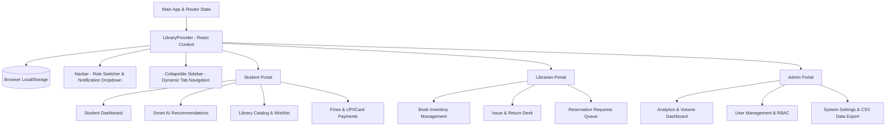

<div align="center">

# 📚 Modern Library Management System (LMS)

### A Smart, Professional & Feature-Rich Digital Library Platform


<br/><br/>

<a href="https://deekshith-stack.github.io/LibraryManagementSystem/">
  
</a>
&nbsp;
<a href="https://github.com/Deekshith-stack/LibraryManagementSystem">
  
</a>

<br/><br/>


<br/><br/>

> **An end-to-end, feature-packed, and responsive Library Management System built with React 19, Vite, and Lucide React. Designed with a modern glassmorphic dark aesthetic, role-based access control (RBAC), AI-personalized smart book recommendations, a multi-category notification center, collapsible sidebar navigation, and automated overdue fine calculations in Indian Rupees (₹).**

</div>

---

## 🌐 Live Application & Links

- 🚀 **Live Demo:** [https://deekshith-stack.github.io/LibraryManagementSystem/](https://deekshith-stack.github.io/LibraryManagementSystem/)
- 📂 **GitHub Repository:** [https://github.com/Deekshith-stack/LibraryManagementSystem](https://github.com/Deekshith-stack/LibraryManagementSystem)

---

## 🌟 Key Highlights & New Features

- **⭐ Smart Book Recommendations:** Intelligent scoring engine that personalizes book suggestions for user **"a"** based on borrowed categories, reading history, wishlist bookmarks, and reader ratings, complete with match percentages (`98% Match`) and contextual reasons (*"Because you read Clean Code"*, *"Top Rated in Programming"*).
- **⭐ Interactive Notification Center:** Dedicated notification hub and navbar dropdown providing real-time alerts:
  - 🔔 *"Your book is due tomorrow."*
  - ⚠️ *"You have ₹40 pending fine."*
  - 📚 *"Your reserved book is now available."*
  - 🎉 *"New books added in Programming."*
- **🎛️ Hide & Unhide Sidebar:** Smooth collapsible sidebar with desktop icon-rail mode, mobile drawer slide-out, and instant navbar toggle buttons.
- **✨ Fresh Starter Architecture:** Zeroed legacy mock data; launches straight into student profile **"a"** with clean circulation logs, curated books in Programming/CS/AI, and automated ₹ Indian Rupee pricing.
- **🛡️ Role-Based Access Control (RBAC):** Switch seamlessly between **Student**, **Librarian**, and **Admin** perspectives from the top navigation bar.
- **💰 Automated Fine Engine:** Real-time calculation of late fees (default: `₹5.00/day`) and integrated simulated payment checkout.
- **💾 Local Persistence:** Browser-backed state synchronization (`localStorage`) preserving custom books, transactions, logs, and settings across refreshes.

---

## 🏛️ System Architecture & Role Portals



---

### 1. 🎓 Student Portal & Recommendations

Designed for students to explore, borrow, reserve, and review books with ease:

- **AI Smart Recommendations:**
  - Dynamic match percentage score (`98% Match`, `95% Match`).
  - Contextual recommendation tags (*"Because you like Programming"*, *"Top Rated in Computer Science"*, *"In your Bookmarks"*).
  - One-click book reservation and wishlist bookmarking.
- **Personalized Dashboard:**
  - Active borrowed books with countdowns to return due dates.
  - Overdue warning badges and status indicators.
  - Personal reservation queue with pending/approved status.
  - Quick statistics (Active Loans, Top Category, Overdue Items, Outstanding Fines in ₹).
- **Search & Filter Catalog:**
  - Real-time instant search by title, author, category, or ISBN.
  - Filter by category (Programming, Computer Science, Artificial Intelligence, Software Engineering, Business, etc.) and availability.
  - Wishlist management and star ratings with reader reviews.
- **Fines & Payments:**
  - Itemized breakdown of overdue fees in Indian Rupees (₹).
  - Simulated online payment checkout with receipt generation.

---

### 2. 🔔 Notification Center

- **Navbar Dropdown & Modal Hub:**
  - Unread notification badge counter with pulse animations.
  - Category filters: `All`, `Unread`, `🔔 Due Dates`, `⚠️ Fines`, `📚 Holds`, `🎉 New Books`.
  - One-click action navigation (e.g. clicking a fine alert navigates directly to the Fines payment tab).
  - "Mark All Read", "Dismiss", and "Clear All" controls.

---

### 3. 📖 Librarian Portal

Empowers librarians with full control over physical book inventory and lending operations:

- **Book Catalog Management:**
  - Add new books with ISBN, category, price (₹), total copies, cover image upload, and shelf locations.
  - Edit metadata or increase/decrease available stock.
  - Remove deprecated books from the circulation database.
- **Issue & Return Operations Desk:**
  - Check out books to active students with automated due date calculation (default: 14 days).
  - Return processing with automated overdue fine evaluation in ₹.
  - Extend loans by 7 days with the "Renew" feature.
  - Send overdue email reminder notices.
- **Reservation Processing Queue:**
  - View all student hold requests in real time.
  - Approve reservations when copies become available.

---

### 4. ⚙️ Admin Portal

Provides system administrators with complete visibility, user control, and system configuration:

- **Executive Analytics Dashboard:**
  - Live metric KPI cards: Catalog Volume, Registered Patrons, Active Loans, Collected Fines (₹).
  - Category distribution charts and popular books leaderboard.
  - System activity & audit logs feed.
  - Export capabilities: Download complete book inventory, patron database, and circulation logs as **CSV**.
- **User Management (RBAC):**
  - Add, edit, or delete users across all roles (`Student`, `Librarian`, `Admin`).
  - Assign Student Enrollment IDs (`STU-2026-XXX`) or Employee IDs (`LIB-2026-XXX`, `ADM-2026-XXX`).
  - Toggle user account status between `Active` and `Suspended`.
- **System Settings:**
  - Configure **Fine Rate per Day** (e.g., `₹5.00/day`).
  - Configure **Borrow Period Limit** (e.g., `14 days`).
  - Configure **Maximum Books Allowed per Student** (e.g., `4 books`).

---

### 5. 📱 Collapsible Sidebar

- **Collapse / Expand Controls:** Easily toggle the sidebar into a space-saving compact rail on desktop or an off-canvas slide-out drawer on mobile screens.
- Accessible via the navbar hamburger button and the sidebar chevron control.

---

## 🛠️ Tech Stack

| Category | Technology | Description |
|---|---|---|
| **Core Framework** | [React 19](https://react.dev/) | Component architecture with hooks (`useState`, `useContext`, `useEffect`, `useMemo`, `useCallback`) |
| **Build & Dev Tool** | [Vite 8](https://vitejs.dev/) | Ultra-fast HMR and optimized production bundling |
| **Icons** | [Lucide React](https://lucide.dev/) | Modern, clean vector iconography |
| **Styling** | Vanilla CSS3 | Custom design system with CSS variables, Glassmorphism, animations, and Grid/Flexbox |
| **State Management** | React Context API | Centralized state in `LibraryContext` with `localStorage` synchronization |
| **CI/CD & Hosting** | [GitHub Pages](https://pages.github.com/) & [GitHub Actions](https://github.com/features/actions) | Continuous deployment workflow |

---

## 📁 Project Directory Structure

```text
LibraryManagementSystem/
├── .github/
│   └── workflows/
│       └── deploy.yml                      # Automated GitHub Actions workflow
├── public/
│   ├── favicon.svg                         # Application favicon
│   └── icons.svg                           # SVG sprite definitions
├── src/
│   ├── components/
│   │   ├── Admin/
│   │   │   ├── Dashboard.jsx               # Admin metrics, analytics, audit log & CSV exports
│   │   │   ├── LibrarySettings.jsx         # Policy settings & fine rate configuration (₹)
│   │   │   └── UserManagement.jsx          # User CRUD, role assignments & status toggles
│   │   ├── Librarian/
│   │   │   ├── BookCatalog.jsx             # Inventory management, add/edit/delete books
│   │   │   ├── IssueReturn.jsx             # Checkout desk, return processor & renewals
│   │   │   └── Reservations.jsx            # Student hold requests & approval queue
│   │   ├── Shared/
│   │   │   ├── Modal.jsx                   # Reusable glassmorphic popup modal
│   │   │   ├── Navbar.jsx                  # Top navbar, role switcher & notification bell
│   │   │   ├── NotificationCenterModal.jsx # Dedicated multi-category notification hub
│   │   │   └── Sidebar.jsx                 # Collapsible responsive sidebar navigation
│   │   └── Student/
│   │       ├── SmartRecommendations.jsx    # AI personalized recommendations widget
│   │       ├── StudentCatalog.jsx          # Book discovery, search, reviews & wishlist
│   │       ├── StudentDashboard.jsx        # Student loans overview & active countdowns
│   │       └── StudentFines.jsx            # Fine payment center & receipt generation (₹)
│   ├── context/
│   │   └── LibraryContext.jsx              # Unified application state, recommendation engine & alerts
│   ├── utils/
│   │   └── mockData.js                     # Starter dataset for books, user 'a', settings & notifications
│   ├── App.css                             # Layout utilities
│   ├── App.jsx                             # Root shell and dynamic portal switcher
│   ├── index.css                           # Design system, themes, animations & UI tokens
│   └── main.jsx                            # React DOM entry point
├── package.json                            # NPM dependencies and scripts
├── README.md                               # Full project documentation
└── vite.config.js                          # Vite configuration with base path setting
```

---

## ⚡ Installation & Local Setup

### Prerequisites
- **Node.js**: v18.0.0 or higher
- **npm**: v9.0.0 or higher

### Steps

1. **Clone the Repository:**
   ```bash
   git clone https://github.com/Deekshith-stack/LibraryManagementSystem.git
   cd LibraryManagementSystem
   ```

2. **Install Dependencies:**
   ```bash
   npm install
   ```

3. **Start Development Server:**
   ```bash
   npm run dev
   ```
   Open your browser and navigate to:
   ```text
   http://localhost:5173/LibraryManagementSystem/
   ```

4. **Production Build & Deploy:**
   ```bash
   npm run deploy
   ```

---

## 📄 License

This project is licensed under the **MIT License**.
