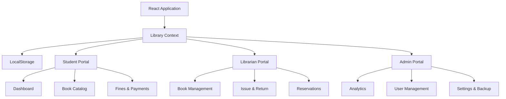
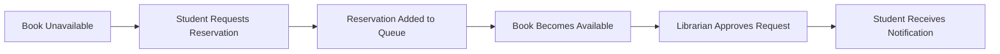

<div align="center">

# 📚 Modern Library Management System

### A Smart, Professional & Feature-Rich Digital Library Platform


<br/><br/>

<a href="https://deekshith-stack.github.io/LibraryManagementSystem/">
  
</a>
&nbsp;
<a href="https://github.com/Deekshith-stack/LibraryManagementSystem">
  
</a>

<br/><br/>


<br/><br/>

> **A modern and intelligent Library Management System designed with professional dashboards, role-based portals, automated workflows, and smart library features.**

</div>

---

## 🌐 Live Demo

<div align="center">

### 🚀 Experience the Application

[](https://deekshith-stack.github.io/LibraryManagementSystem/)

**🔗 https://deekshith-stack.github.io/LibraryManagementSystem/**

</div>

---

# 🎬 Application Preview

<div align="center">

<!--
IMPORTANT:
Record your website screen and save it as:

assets/library-demo.gif

Then this animation will automatically appear here.
-->


</div>

> 🎥 **Tip:** Add a 5–10 second screen recording showing navigation between the Student, Librarian, and Admin portals. Convert it into `library-demo.gif` and place it inside the `assets` folder.

---

# ✨ Project Overview

The **Modern Library Management System (LMS)** is a professional and responsive web application designed to simplify and modernize library operations.

The system provides dedicated portals for:

<div align="center">

|     🎓 Student     |     📖 Librarian    |  ⚙️ Administrator |
| :----------------: | :-----------------: | :---------------: |
|  Browse & Reserve  |     Manage Books    |  Complete Control |
|     Track Loans    |    Issue & Return   |     Analytics     |
|      Pay Fines     | Manage Transactions |  User Management  |
| Reviews & Wishlist |  Reservation Queue  | Settings & Backup |

</div>

---

# 🌟 Key Highlights

<div align="center">

|               🔐 RBAC              |        📚 Smart Catalog       |         💰 Auto Fines         |
| :--------------------------------: | :---------------------------: | :---------------------------: |
| Student, Librarian & Admin portals | Advanced search and filtering | Automatic overdue calculation |

|      📌 Reservations      |  🔔 Notifications | 💾 Local Persistence |
| :-----------------------: | :---------------: | :------------------: |
| Reserve unavailable books | Role-based alerts | Browser LocalStorage |

|         📊 Analytics         |       📥 Export      |             🎨 Modern UI            |
| :--------------------------: | :------------------: | :---------------------------------: |
| Smart dashboards and metrics | CSV and JSON reports | Glassmorphism and responsive design |

</div>

---

# 🏛️ System Architecture



---

# 🎓 Student Portal

The Student Portal provides a complete digital library experience.

## Features

* 📊 Personalized Dashboard
* 🔎 Smart Book Search
* 🏷️ Advanced Filters
* 📚 Book Borrowing History
* ⏳ Due Date Tracking
* ⚠️ Overdue Alerts
* 📌 Book Reservations
* ❤️ Wishlist Management
* ⭐ Book Ratings & Reviews
* 💰 Fine Tracking
* 🧾 Payment Receipts
* 🔔 Personalized Notifications

### Student Experience

```text
Discover Books
      ↓
Search & Filter
      ↓
View Availability
      ↓
Reserve / Borrow
      ↓
Track Due Date
      ↓
Return Book
```

---

# 📖 Librarian Portal

The Librarian Portal provides complete control over daily library operations.

## Features

* ➕ Add Books
* ✏️ Edit Book Information
* 🗑️ Remove Books
* 📦 Manage Book Copies
* 📍 Shelf Location Management
* 📤 Issue Books
* 📥 Return Books
* ⏰ Automatic Due Dates
* 💰 Automatic Fine Calculation
* 📋 Transaction Management
* 📌 Reservation Processing

---

## 📤 Book Issue Workflow

```text
┌──────────────────────┐
│   Select Student     │
└──────────┬───────────┘
           ↓
┌──────────────────────┐
│    Select Book       │
└──────────┬───────────┘
           ↓
┌──────────────────────┐
│ Check Availability   │
└──────────┬───────────┘
           ↓
┌──────────────────────┐
│     Issue Book       │
└──────────┬───────────┘
           ↓
┌──────────────────────┐
│ Generate Due Date    │
└──────────────────────┘
```

---

# ⚙️ Admin Portal

The Admin Portal provides complete visibility and control over the entire Library Management System.

## Features

* 📊 Analytics Dashboard
* 👥 User Management
* 🎓 Student Management
* 📖 Librarian Management
* 🔐 Role-Based Access Control
* 🚫 Account Suspension
* 📚 Inventory Monitoring
* ⚠️ Overdue Monitoring
* 💰 Fine Tracking
* 📄 Activity Logs
* 📥 Data Export
* 💾 System Backup
* ♻️ Data Restore
* 🗑️ Factory Reset

---

# 📊 Smart Analytics Dashboard

The system provides real-time insights into library activity.

```text
╭────────────────────────────────────────────╮
│              LIBRARY ANALYTICS             │
├────────────────────────────────────────────┤
│                                            │
│   📚 Total Books             500+          │
│   👥 Registered Users        1,200+        │
│   📖 Active Loans            125           │
│   ⚠️ Overdue Books           12            │
│   💰 Fine Revenue            ₹2,500        │
│                                            │
╰────────────────────────────────────────────╯
```

---

# 💰 Automated Fine Calculation

The system automatically calculates overdue fines.

```text
Issue Date:      10 August 2026
Due Date:        24 August 2026
Return Date:     28 August 2026

Overdue Days:    4
Fine Rate:       ₹10 / Day

━━━━━━━━━━━━━━━━━━━━━━

Total Fine:      ₹40
```

The fine rate can be configured from the **Admin Settings Panel**.

---

# 📌 Book Reservation System

When a book is unavailable, students can request a reservation.



---

# 🔔 Smart Notification System

The application provides a centralized notification center.

### Example Notifications

```text
📚 Your book has been issued successfully.

⚠️ Your book is due tomorrow.

📌 Your reserved book is now available.

💰 You have a pending fine.

📖 Your book has been returned successfully.
```

---

# 💾 Persistent Data Storage

The frontend application currently uses **Browser LocalStorage** for data persistence.

```text
lms_books
lms_users
lms_transactions
lms_reservations
lms_settings
lms_payment_records
lms_notifications
lms_system_logs
```

> 💡 The system can later be integrated with **Java Spring Boot + MySQL** to create a complete enterprise-level full-stack application.

---

# 🛠️ Technology Stack

<div align="center">

| Technology           | Purpose                  |
| -------------------- | ------------------------ |
| ⚛️ React 19          | Frontend Framework       |
| ⚡ Vite               | Development & Build Tool |
| 🟨 JavaScript        | Application Logic        |
| 🎨 Vanilla CSS       | Styling & Animations     |
| 🔥 React Context API | State Management         |
| 🗂️ LocalStorage     | Data Persistence         |
| 🎯 Lucide React      | Modern Icons             |
| 🚀 GitHub Pages      | Deployment               |

</div>

---

# 📁 Project Structure

```text
LibraryManagementSystem/
│
├── .github/
│   └── workflows/
│       └── deploy.yml
│
├── public/
│   ├── 404.html
│   ├── favicon.svg
│   └── icons.svg
│
├── assets/
│   └── library-demo.gif
│
├── src/
│   │
│   ├── components/
│   │   ├── Admin/
│   │   │   ├── Dashboard.jsx
│   │   │   ├── LibrarySettings.jsx
│   │   │   └── UserManagement.jsx
│   │   │
│   │   ├── Librarian/
│   │   │   ├── BookCatalog.jsx
│   │   │   ├── IssueReturn.jsx
│   │   │   └── Reservations.jsx
│   │   │
│   │   ├── Shared/
│   │   │   ├── Navbar.jsx
│   │   │   ├── Sidebar.jsx
│   │   │   └── Modal.jsx
│   │   │
│   │   └── Student/
│   │       ├── StudentDashboard.jsx
│   │       ├── StudentCatalog.jsx
│   │       └── StudentFines.jsx
│   │
│   ├── context/
│   │   └── LibraryContext.jsx
│   │
│   ├── utils/
│   │   └── mockData.js
│   │
│   ├── App.jsx
│   └── main.jsx
│
├── README.md
├── package.json
└── vite.config.js
```

---

# ⚡ Getting Started

## Prerequisites

Make sure you have installed:

* Node.js `v18+`
* npm `v9+`

---

## 1️⃣ Clone the Repository

```bash
git clone https://github.com/Deekshith-stack/LibraryManagementSystem.git
```

## 2️⃣ Navigate to the Project

```bash
cd LibraryManagementSystem
```

## 3️⃣ Install Dependencies

```bash
npm install
```

## 4️⃣ Start Development Server

```bash
npm run dev
```

---

# 🏗️ Production Build

Create an optimized production build:

```bash
npm run build
```

Preview the production build:

```bash
npm run preview
```

---

# 🚀 Deployment

This project is deployed using **GitHub Pages**.

<div align="center">

### 🌐 Live Application

[](https://deekshith-stack.github.io/LibraryManagementSystem/)

</div>

Manual deployment:

```bash
npm run deploy
```

---

# 🎨 UI & UX Highlights

The application is designed to provide a modern and premium experience.

### Design Features

* ✨ Modern Glassmorphism
* 📱 Fully Responsive Layout
* 🖥️ Professional Dashboard
* 🎨 Premium Color System
* 🧩 Reusable Components
* 🔄 Dynamic Role Switching
* 🔔 Notification Animations
* 📊 Smart Statistics
* 🪟 Animated Modals
* 🏷️ Status Badges
* ⚡ Smooth Interactions

---

# 🔮 Future Enhancements

The project can be expanded with the following technologies and features:

* 🔐 Real Authentication
* ☕ Java Spring Boot Backend
* 🗄️ MySQL Database
* 🤖 AI Library Assistant
* 📚 AI Book Recommendations
* 📷 Barcode Scanner
* 🔳 QR Code Integration
* 📱 Mobile Application
* 📄 Digital Library
* 💳 Online Fine Payment
* 📧 Email Notifications
* 📱 WhatsApp Notifications
* 📊 Advanced Reports

---

# 🎯 What This Project Demonstrates

This project demonstrates practical knowledge of:

```text
✓ React Component Architecture
✓ React Context API
✓ State Management
✓ Role-Based Interfaces
✓ CRUD Operations
✓ Transaction Workflows
✓ Fine Calculation Logic
✓ Local Data Persistence
✓ Responsive Web Design
✓ GitHub Deployment
✓ Professional UI/UX
```

---

# 👨‍💻 Developer

<div align="center">

## Deekshith Reddy

**Software Developer • React Developer • Web Developer**

<a href="https://github.com/Deekshith-stack">
  
</a>

<br/><br/>

### ⭐ If you like this project, give it a Star!

**Made with ❤️ using React & Vite**

</div>


