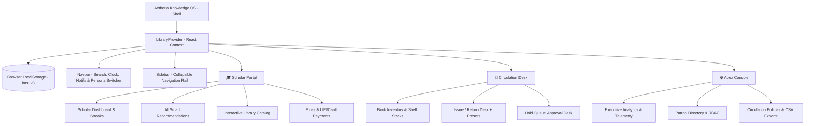

<div align="center">

# ⚡ Aetheria Knowledge OS

### Intelligent Digital Library & Circulation Engine


<br/><br/>

<a href="https://deekshith-stack.github.io/LibraryManagementSystem/">
  
</a>
&nbsp;
<a href="https://github.com/Deekshith-stack/LibraryManagementSystem">
  
</a>

<br/><br/>


<br/><br/>

> **Aetheria Knowledge OS** is a modern, high-performance digital library platform built with **React 19**, **Vite**, and custom **Dark Glassmorphism CSS**. Designed with clean SaaS navigation, an intuitive **Persona Switcher popover**, heuristic AI book recommendations, multi-category notification alerts, collapsible sidebar rails, and automated Indian Rupee (₹) fine calculation.

</div>

---

## 🌐 Live Application & Links

- 🚀 **Live Production Link:** [https://deekshith-stack.github.io/LibraryManagementSystem/](https://deekshith-stack.github.io/LibraryManagementSystem/)
- 📂 **GitHub Repository:** [https://github.com/Deekshith-stack/LibraryManagementSystem](https://github.com/Deekshith-stack/LibraryManagementSystem)

---

## 🎨 Three Distinct Portal Experiences

<div align="center">

| 🎓 **Scholar Hub** *(Student)* | 📖 **Circulation Desk** *(Librarian)* | ⚙️ **Apex Console** *(Admin)* |
| :---: | :---: | :---: |
| *Celestial Cyan & Indigo Theme* | *Emerald & Teal Operational Desk* | *Violet & Rose Executive Suite* |
| AI Recommendation Scoring | Shelf Stacks & Low-Stock Alerts | Real-Time Audit Telemetry Stream |
| Daily Reading Streaks | 1-Click Lending Windows (+7, +14, +30d) | Category Distribution Progress Bars |
| Active Loan Due-Date Chips | Hold Request Processing Queue | User Governance & RBAC Directory |
| Digital Receipts & UPI / Card Pay | Fine Recovery & Overdue Alerts | One-Click CSV System Snapshots |

</div>

---

## 🌟 Key Platform Features

- **👤 Luxury Persona Switcher:** Clean top navigation bar with a profile avatar pill; clicking opens a luxury popover to switch between **Scholar ("a")**, **Head Librarian**, and **Apex Administrator**.
- **⭐ Smart Book Recommendations:** Intelligent scoring algorithm personalizing book suggestions based on borrowing history, genre affinity, wishlist bookmarks, and reader ratings, complete with match percentage badges (`98% Match`) and affinity reason tags (*"Because you read Clean Code"*, *"Top Rated in Programming"*).
- **⭐ Real-Time Notification Center:** Dropdown & dedicated modal hub delivering instant alerts:
  - 🔔 *"Your book is due tomorrow."*
  - ⚠️ *"You have ₹40 pending fine."*
  - 📚 *"Your reserved book is now available."*
  - 🎉 *"New books added in Programming."*
- **🎛️ Collapsible Sidebar (Hide / Unhide):** Space-saving desktop icon-rail mode and fluid off-canvas drawer on mobile screens with top navbar toggle.
- **🕒 Live System Clock & Pulse:** Top status widget showing real-time system time with live status dot.
- **💰 Automated Indian Rupee (₹) Engine:** Real-time calculation of late fees (default: `₹5.00/day`), checkout drawer with card/UPI simulation, and digital receipt generation.
- **💾 Browser-Synced Local State:** LocalStorage caching ensures seamless offline-ready data persistence across browser sessions.

---

## 🏛️ System Architecture



---

## 📁 Project Directory Structure

```text
LibraryManagementSystem/
├── .github/
│   └── workflows/
│       └── deploy.yml                      # GitHub Actions automated deployment
├── public/
│   ├── favicon.svg                         # Aetheria OS Favicon
│   └── icons.svg                           # SVG sprite definitions
├── src/
│   ├── components/
│   │   ├── Admin/
│   │   │   ├── Dashboard.jsx               # Apex analytics & telemetry feed
│   │   │   ├── LibrarySettings.jsx         # Circulation policies & fine rates (₹)
│   │   │   └── UserManagement.jsx          # Patron & staff credentials management
│   │   ├── Librarian/
│   │   │   ├── BookCatalog.jsx             # Inventory cataloger & shelf stack monitor
│   │   │   ├── IssueReturn.jsx             # Circulation checkout desk & renewals
│   │   │   └── Reservations.jsx            # Student hold requests & approval queue
│   │   ├── Shared/
│   │   │   ├── Modal.jsx                   # Reusable glassmorphic popup modal
│   │   │   ├── Navbar.jsx                  # Clean navbar with Persona Switcher popover
│   │   │   ├── NotificationCenterModal.jsx # Multi-category notification center modal
│   │   │   └── Sidebar.jsx                 # Collapsible navigation rail & brand badge
│   │   └── Student/
│   │       ├── SmartRecommendations.jsx    # AI personalized recommendations widget
│   │       ├── StudentCatalog.jsx          # Book discovery, search & reader reviews
│   │       ├── StudentDashboard.jsx        # Scholar dashboard, streaks & loan chips
│   │       └── StudentFines.jsx            # Fine checkout gateway & digital receipts
│   ├── context/
│   │   └── LibraryContext.jsx              # Unified context & recommendation engine
│   ├── utils/
│   │   └── mockData.js                     # Starter dataset & seed alerts
│   ├── App.css                             # Layout helpers
│   ├── App.jsx                             # Application shell & portal router
│   ├── index.css                           # Aetheria Glassmorphic Design System
│   └── main.jsx                            # React 19 root mount
├── package.json                            # Scripts & dependencies
├── README.md                               # Comprehensive documentation
└── vite.config.js                          # Vite bundler configuration
```

---

## ⚡ Local Setup & Deployment

### Run Locally
```bash
# 1. Clone the repository
git clone https://github.com/Deekshith-stack/LibraryManagementSystem.git
cd LibraryManagementSystem

# 2. Install dependencies
npm install

# 3. Start development server
npm run dev
```

### Production Build & Deploy
```bash
# Deploy to GitHub Pages
npm run deploy
```

---

## 📄 License

This project is licensed under the **MIT License**.
