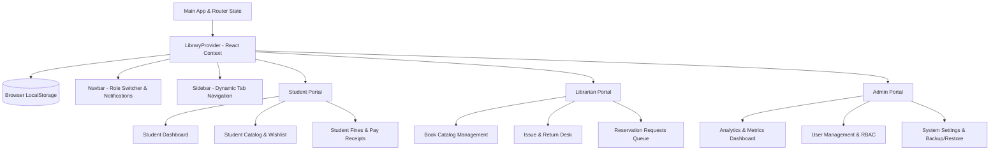

# 📚 Modern Library Management System (LMS)

[](https://react.dev/)
[](https://vitejs.dev/)
[](https://deekshith-stack.github.io/LibraryManagementSystem/)
[](LICENSE)

An end-to-end, feature-rich, and responsive **Library Management System (LMS)** built with **React 19**, **Vite**, and **Lucide React**. Designed with a modern glassmorphic aesthetic, role-based access control (RBAC), real-time notifications, local persistence, transaction workflows, and fine calculation algorithms.

---

## 🌐 Live Application & Links

- 🚀 **Live Demo:** [https://deekshith-stack.github.io/LibraryManagementSystem/](https://deekshith-stack.github.io/LibraryManagementSystem/)
- 📂 **GitHub Repository:** [https://github.com/Deekshith-stack/LibraryManagementSystem](https://github.com/Deekshith-stack/LibraryManagementSystem)

---

## 📑 Table of Contents

- [Key Highlights](#-key-highlights)
- [System Architecture & Role Portals](#-system-architecture--role-portals)
  - [1. 🎓 Student Portal](#1--student-portal)
  - [2. 📖 Librarian Portal](#2--librarian-portal)
  - [3. ⚙️ Admin Portal](#3--admin-portal)
  - [4. 🔔 Shared & Global Capabilities](#4--shared--global-capabilities)
- [Tech Stack](#-tech-stack)
- [Project Directory Structure](#-project-directory-structure)
- [State Management & Data Schema](#-state-management--data-schema)
- [Installation & Local Setup](#-installation--local-setup)
- [Build & Deployment Workflow](#-build--deployment-workflow)
- [Customization & Configuration](#-customization--configuration)
- [License](#-license)

---

## 🌟 Key Highlights

- **Role-Based Access Control (RBAC):** Switch seamlessly between **Student**, **Librarian**, and **Admin** perspectives from the top navigation bar.
- **Glassmorphic Modern UI:** Curated color palette, sleek cards, micro-interactions, responsive sidebars, modals, and status badges.
- **Automated Fine Calculation:** Dynamic calculation of overdue charges based on real-time date differences and configurable fine rates.
- **Persistent Storage:** Comprehensive state management backed by `localStorage` for books, users, transactions, reservations, payment receipts, audit logs, and settings.
- **Data Export & Backup:** Export catalog and user reports to CSV or JSON, with complete database backup and restore functionality.
- **Zero-Configuration Deployment:** Automated GitHub Actions workflow and manual `gh-pages` branch build integration.

---

## 🏛️ System Architecture & Role Portals



---

### 1. 🎓 Student Portal

Designed for students to explore, borrow, reserve, and review books with ease:

- **Personalized Dashboard:**
  - Active borrowed books with countdowns to return due dates.
  - Overdue warning badges and status indicators.
  - Personal reservation queue with pending/approved indicators.
  - Quick statistics (Total Borrowed, Active Loans, Overdue Items, Unpaid Fines).
- **Search & Filter Catalog:**
  - Real-time instant search by title, author, category, or ISBN.
  - Filter by category (Computer Science, Software Engineering, Artificial Intelligence, Self-Help, Business, etc.) and availability.
  - Sort by Title, Rating, or Availability.
  - One-click book reservation for items with 0 available copies.
  - Wishlist management (add/remove favorites).
  - Star ratings and reader reviews.
- **Fines & Payments:**
  - Breakdown of returned overdue transactions and active late fees.
  - Automated fine calculations based on overdue days.
  - Simulated online payment checkout with instantaneous receipt generation and payment history.

---

### 2. 📖 Librarian Portal

Empowers librarians with full control over physical book inventory and lending operations:

- **Book Catalog Management:**
  - Add new books with ISBN, category, price, total copies, and shelf locations (e.g., `Shelf A-3`, `Shelf B-1`).
  - Edit metadata or increase/decrease available copy quantities.
  - Remove deprecated books from the circulation database.
- **Issue & Return Operations Desk:**
  - Direct issue flow: select student, pick book, and generate a loan with automated due date calculation (default: 14 days).
  - Return processing with automated overdue fine evaluation.
  - Filter transactions by status: `All`, `Issued`, `Returned`, `Overdue`.
- **Reservation Processing Queue:**
  - View all student hold requests in real time.
  - Approve reservations when copies become available, or cancel invalid requests.

---

### 3. ⚙️ Admin Portal

Provides system administrators with complete visibility, user control, and system configuration:

- **Executive Analytics Dashboard:**
  - Live metric KPI cards: Total Books, Registered Users, Active Loans, Overdue Loans, Total Revenue/Fines Collected.
  - Overdue loans monitor with instant student and librarian contact info.
  - System activity & audit logs feed.
  - Export capabilities: Download complete book inventory and user database as **CSV** or **JSON**.
- **User Management (RBAC):**
  - Add, edit, or delete users across all roles (`Student`, `Librarian`, `Admin`).
  - Assign Student Enrollment IDs (`STU-2026-XXX`) or Employee IDs (`LIB-2026-XXX`, `ADM-2026-XXX`).
  - Toggle user account status between `Active` and `Suspended`.
- **System Settings & Data Governance:**
  - Configure **Fine Rate per Day** (e.g., `$1.50/day`).
  - Configure **Borrow Period Limit** (e.g., `14 days`).
  - Configure **Maximum Books Allowed per Student** (e.g., `4 books`).
  - **Full System Backup:** Export entire application state (books, users, transactions, logs, settings) to a `.json` backup file.
  - **Database Restore:** Restore system state from a previous JSON backup.
  - **Factory Reset:** Reset entire database to default mock seed data.

---

### 4. 🔔 Shared & Global Capabilities

- **Real-Time Notification Center:** Unread notification counter badge with role-filtered notifications (Student alerts, Librarian hold notifications, Admin audit events).
- **Session Tracking:** Records login and logout timestamps for every user in the system.
- **Global Search:** Contextual search bar integrated into the navigation bar that synchronizes across active views.
- **Modal Component:** Reusable animated glass modal for forms, payment dialogs, and confirmation prompts.

---

## 🛠️ Tech Stack

| Category | Technology | Description |
|---|---|---|
| **Core Framework** | [React 19](https://react.dev/) | Component architecture with hooks (`useState`, `useContext`, `useEffect`, `useMemo`) |
| **Build & Dev Tool** | [Vite 8](https://vitejs.dev/) | Ultra-fast HMR and optimized production bundling |
| **Icons** | [Lucide React](https://lucide.dev/) | Modern, clean vector iconography |
| **Styling** | Vanilla CSS3 | Custom design system with CSS variables, Glassmorphism, animations, and Grid/Flexbox |
| **State Management** | React Context API | Centralized state in `LibraryContext` with `localStorage` synchronization |
| **CI/CD & Hosting** | [GitHub Pages](https://pages.github.com/) & [GitHub Actions](https://github.com/features/actions) | Continuous deployment workflow |

---

## 📁 Project Directory Structure

```text
LibraryManagementSystem/
├── .github/
│   └── workflows/
│       └── deploy.yml            # Automated GitHub Actions workflow for GitHub Pages
├── public/
│   ├── 404.html                  # Fallback redirect for SPA GitHub Pages routing
│   ├── favicon.svg               # Application favicon
│   └── icons.svg                 # SVG sprite definitions
├── src/
│   ├── assets/                   # Static media and graphics
│   ├── components/
│   │   ├── Admin/
│   │   │   ├── Dashboard.jsx         # Admin metrics, analytics, audit log & exports
│   │   │   ├── LibrarySettings.jsx   # Policy settings, backup & restore tools
│   │   │   └── UserManagement.jsx    # User CRUD, role assignments & status toggles
│   │   ├── Librarian/
│   │   │   ├── BookCatalog.jsx       # Inventory management, add/edit/delete books
│   │   │   ├── IssueReturn.jsx       # Checkout desk, return processor & overdue tracker
│   │   │   └── Reservations.jsx      # Student hold requests & approval queue
│   │   ├── Shared/
│   │   │   ├── Modal.jsx             # Reusable glassmorphic popup modal
│   │   │   ├── Navbar.jsx            # Top navbar, role selector & notification dropdown
│   │   │   └── Sidebar.jsx           # Dynamic responsive sidebar navigation
│   │   └── Student/
│   │       ├── StudentCatalog.jsx    # Book discovery, search, reviews & wishlist
│   │       ├── StudentDashboard.jsx  # Student loans overview & active countdowns
│   │       └── StudentFines.jsx      # Fine payment center & receipt generation
│   ├── context/
│   │   └── LibraryContext.jsx        # Unified application state & handler functions
│   ├── utils/
│   │   └── mockData.js               # Seed dataset for books, users, transactions & rules
│   ├── App.css                       # Application layout rules
│   ├── App.jsx                       # Root shell and dynamic portal switcher
│   ├── index.css                     # Comprehensive design system, themes & UI tokens
│   └── main.jsx                      # React DOM entry point
├── .gitignore                        # Git exclusion rules
├── DEPLOYMENT.md                     # Deployment guide & specifications
├── eslint.config.js                  # ESLint configuration
├── index.html                        # Main HTML template
├── package.json                      # NPM dependencies and scripts
├── README.md                         # Full project documentation
└── vite.config.js                    # Vite configuration with base path setting
```

---

## 💾 State Management & Data Schema

All persistent state is stored in `localStorage` under distinct keys:

| Key | Type | Description |
|---|---|---|
| `lms_books` | `Array<Book>` | Books catalog with copies, ratings, reviews, and wishlist |
| `lms_users` | `Array<User>` | User accounts with roles (`student`, `librarian`, `admin`), IDs, and status |
| `lms_transactions` | `Array<Transaction>` | Lending history with issue dates, due dates, return dates, and fines |
| `lms_reservations` | `Array<Reservation>` | Student reservation holds (`pending`, `approved`, `cancelled`) |
| `lms_settings` | `Object` | Loan policies: `fineRatePerDay`, `maxBooksAllowed`, `borrowPeriodDays` |
| `lms_payment_records`| `Array<Payment>` | Receipts for paid overdue fines |
| `lms_notifications`  | `Array<Notification>`| System alerts filtered by target role |
| `lms_system_logs`    | `Array<Log>` | Audit trail of significant events and transactions |

### Sample Data Schemas

#### Book Entity
```json
{
  "id": "book-1",
  "title": "Clean Code",
  "author": "Robert C. Martin",
  "isbn": "978-0132350884",
  "category": "Software Engineering",
  "price": 49.99,
  "copiesAvailable": 3,
  "totalCopies": 4,
  "location": "Shelf A-3",
  "rating": 4.8,
  "reviews": [],
  "wishlist": []
}
```

#### Transaction Entity
```json
{
  "id": "tx-1",
  "bookId": "book-1",
  "bookTitle": "Clean Code",
  "studentId": "user-student-1",
  "studentName": "Alex Mercer",
  "issueDate": "2026-08-12",
  "dueDate": "2026-08-26",
  "returnDate": "2026-08-26",
  "fineAmount": 0,
  "status": "returned"
}
```

---

## ⚡ Installation & Local Setup

### Prerequisites
- **Node.js**: v18.0.0 or higher
- **npm**: v9.0.0 or higher

### Steps

1. **Clone the Repository:**
   ```bash
   git clone https://github.com/Deekshith-stack/LibraryManagementSystem.git
   cd LibraryManagementSystem
   ```

2. **Install Dependencies:**
   ```bash
   npm install
   ```

3. **Start Development Server:**
   ```bash
   npm run dev
   ```
   Open your browser and navigate to:
   ```text
   http://localhost:5173/LibraryManagementSystem/
   ```

4. **Production Build:**
   ```bash
   npm run build
   ```

5. **Preview Production Build:**
   ```bash
   npm run preview
   ```

---

## 🚀 Build & Deployment Workflow

### 1. Automatic Deployment (GitHub Actions)
The repository includes `.github/workflows/deploy.yml`. Whenever changes are pushed to the `main` branch, the workflow automatically:
1. Installs clean dependencies via `npm ci`.
2. Runs the production build (`npm run build`).
3. Uploads the `./dist` folder to GitHub Pages.

### 2. Manual Deployment via `gh-pages`
You can also deploy directly from the command line:
```bash
npm run deploy
```
This triggers the `predeploy` build hook and pushes the `./dist` folder to the `gh-pages` branch.

> [!NOTE]
> Ensure that under **Repository Settings > Pages**, the Source is set to either **GitHub Actions** or the **`gh-pages` branch**.

---

## ⚙️ Customization & Configuration

- **Vite Base Path:** Configured in `vite.config.js`:
  ```javascript
  export default defineConfig({
    plugins: [react()],
    base: '/LibraryManagementSystem/',
  });
  ```
- **Fine Rates & Borrow Period:** Change default values via the **Admin Portal > Settings** tab, or modify `initialSettings` in [`src/utils/mockData.js`](file:///c:/Users/boona/OneDrive/Desktop/LibraryManagementSystem/src/utils/mockData.js).

---

## 📄 License

This project is licensed under the **MIT License**. Feel free to use, modify, and distribute this codebase for academic or commercial purposes.